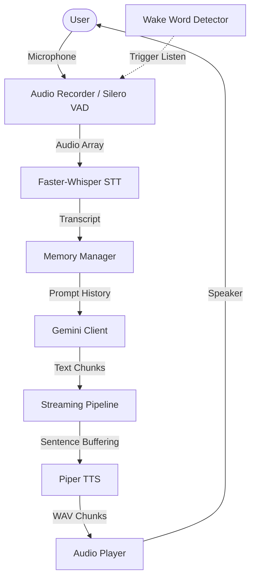

# Nate: Real-Time Conversational AI Assistant

Nate is a modular, real-time conversational voice assistant utilizing a pipelined audio architecture. It processes user speech, manages short-term memory context, generates responses via LLMs, and synthesizes natural-sounding speech feedback with low latency.

---

## Features

### Speech & Audio Pipeline
* **Voice Activity Detection**: Real-time silence and speech probability boundaries detection using Silero VAD.
* **Speech-to-Text**: Low-latency transcription utilizing Faster-Whisper with automatic hardware acceleration (CUDA float16 when available, falling back to CPU int8).
* **Text-to-Speech**: High-fidelity, localized speech synthesis using a persistent Piper TTS background subprocess via interactive JSON IPC.
* **Continuous Playback**: Sentence-by-sentence queue-based audio playback system allowing natural pacing.

### Intelligence & Context
* **Conversational Memory**: Stores conversation turns (user/assistant) and provides recent context history to the language model.
* **Gemini LLM Integration**: Generates responses using Gemini Flash models with custom temperature, token limits, and reasoning budget disabled for minimal latency.
* **Intelligent Fillers**: Plays localized background vocal fillers during remote LLM connection latency to improve conversation flow.

### User Experience & Frontend
* **Voice-First Design**: Minimal interface centered around natural speech interactions.
* **Real-Time Visual Indicators**: OpenWebUI-inspired interface showing state transitions (Listening, Thinking, Streaming, Speaking, Wake word listening) via animated indicators.
* **Collapsible Telemetry Panel**: A responsive sidebar showing active hardware details, engine latency profiles, and model characteristics.

### Infrastructure
* **Streaming Architecture**: Employs async generators and WebSocket streams to push LLM text chunks and play audio fragments sentence-by-sentence before the response completes.
* **Hardware Interruption**: Interrupts active audio synthesis and speakers playback instantly if the user clicks or speaks during responses.

---

## Architecture Overview



Each module operates independently under a unified session state manager, minimizing coupling between hardware capture, cloud endpoints, and local inference models.

---

## System Pipeline

```
Microphone → Wake Word Detection → Silero VAD → Faster-Whisper → Memory Store → Gemini LLM (Streaming) → Sentence Buffer → Piper TTS → Audio Queue Playback
```

1. **Idle State**: The assistant listens continuously for the "Hey Nate" wake phrase.
2. **Recording**: When triggered, VAD monitors input and stops automatically after a configured period of silence.
3. **Transcription**: The audio array is sent directly to Faster-Whisper.
4. **LLM Querying**: The transcript is stored in memory and sent to Gemini.
5. **Streaming Synthesis**: Complete sentences are split from the streaming LLM output and fed to the TTS queue.
6. **Playback**: The audio plays while remaining text chunks are processed.

---

## Screenshots

<div align="center">
  
  <p><em>Nate OpenWebUI-inspired conversational interface.</em></p>
</div>

<br>

<div align="center">
  
  <p><em>High-level architecture and subsystem relationships.</em></p>
</div>

---

## Technology Stack

| Component | Technology |
| :--- | :--- |
| **Language** | Python 3.10+ |
| **Backend Framework** | FastAPI, Uvicorn |
| **Frontend Framework** | Next.js 16, React 19, TailwindCSS, Framer Motion |
| **Voice Activity Detection** | Silero VAD |
| **Speech Recognition** | Faster Whisper |
| **Language Model** | Gemini 3.1 Flash Lite (via Google GenAI SDK) |
| **Text-to-Speech** | Piper TTS |
| **Wake Word Detection** | OpenWakeWord |
| **Audio I/O** | Sounddevice, Soundfile, PyAudio |

---

## Installation & Setup

### 1. Clone the Repository
```bash
git clone https://github.com/your-username/Nate.git
cd Nate
```

### 2. Create Virtual Environment
```bash
python -m venv venv
```

**Activate the environment:**
* **Windows (PowerShell):**
  ```powershell
  .\venv\Scripts\Activate.ps1
  ```
* **macOS / Linux:**
  ```bash
  source venv/bin/activate
  ```

### 3. Install Dependencies
```bash
pip install -r requirements.txt
pip install openwakeword
```

### 4. Configure Environment
Create a `.env` file in the root directory:
```env
GEMINI_API_KEY=your_gemini_api_key_here
GEMINI_MODEL=gemini-3.1-flash-lite
WHISPER_MODEL=small
```

Ensure the Piper executable and voice ONNX files are placed in:
```
models/piper/
├── piper.exe
├── en_US-joe-medium.onnx
├── en_US-joe-medium.onnx.json
└── espeak-ng-data/
```

---

## Running the Application

### 1. Start the Backend API Server
```bash
uvicorn server:app --reload --port 8000
```

### 2. Start the Frontend Dev Server
In a new terminal window:
```bash
cd frontend
npm run dev
```

Open [http://localhost:3000](http://localhost:3000) in your web browser.

---

## Usage

* **Wake Word Interaction**: Toggle the "Wake Word" button on the top header. Speak "Hey Nate" to activate listening.
* **Manual Interaction**: Click the microphone button in the footer to start or stop a manual recording session.
* **Diagnostics**: Click "Show Telemetry" in the header to view active model configurations and real-time processing latencies.

---

## Performance Metrics

* **STT (Faster-Whisper)**: Typical transcription times are under 400ms on CUDA-compatible GPUs, and 800ms–1.5s on mid-tier CPUs.
* **LLM (Gemini 3.1 Flash Lite)**: Time-to-first-chunk is typically 400–600ms.
* **TTS (Piper ONNX)**: Sentence-level synthesis executes in less than 200ms, running faster than real-time playback.
* **Audio Playback**: Immediate playback start under 50ms.

---

## Project Roadmap

* [x] VAD & Microphone Capture
* [x] Faster-Whisper Integration
* [x] Memory & Context Layer
* [x] Gemini API Integration
* [x] Piper Speech Synthesis
* [x] Web Interface Scaffolding
* [x] Streaming Text & TTS Pipeline
* [x] Wake Word Support (OpenWakeWord)

---

## License & Credits

Designed and built by Noel Ninan Sheri. All rights reserved.
